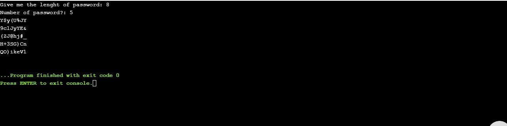

# RandomPasswordGenerator
This Script Will Give You Unique Random Passwordon every go.
First this script will ask you the length of the password that you want.
After that it will ask you that how many password you want of that lenght[Which you have given Input in above command].
And that's all. You will get the output after this.

If you clone this and you want to run this on your machine, you have to import 'random' module which is a package from the python standard library.
